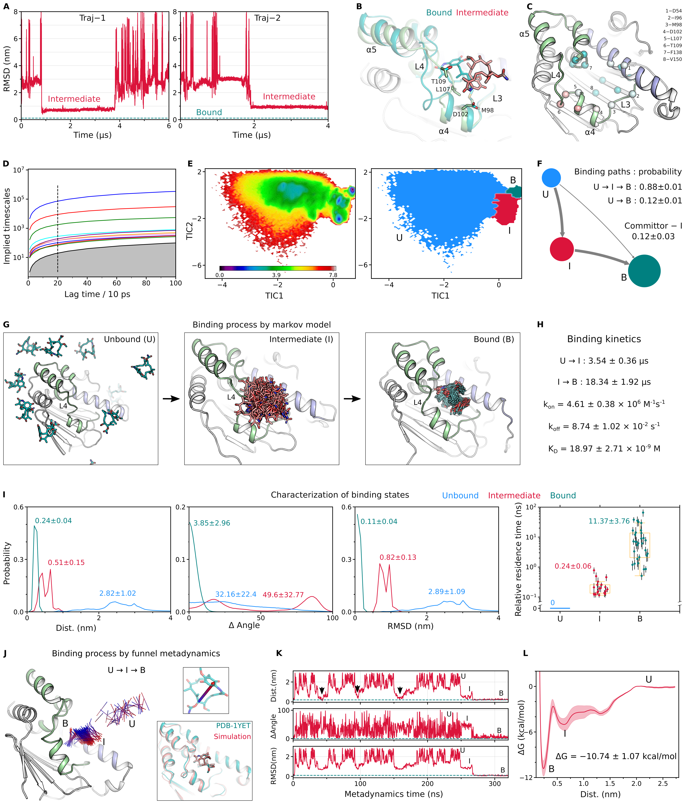

Heat shock protein 90 (Hsp90) is an essential molecular chaperone that plays a critical role in protein folding, stabilization, and activation, positioning it as a prominent target in cancer therapy. The activation of Hsp90 is stringently controlled by conformational dynamics within its N-terminal domain (N-Hsp90), which contains the ATP-binding site and serves as the main focus for the development of small-molecule inhibitors. However, despite the development of numerous small-molecule inhibitors, effectively targeting N-Hsp90 remains challenging and this difficulty arises from conflicting crystallographic and NMR structures. Here, through statistical analysis of aggregated 60 microseconds of all-atom unbiased Molecular Dynamics (MD) simulations, that capture various stages of the recognition process of the prominent inhibitor Geldanamycin (GDM) with N-Hsp90, we reveal that the inhibitor binding event is dictated by intrinsic conformational heterogeneity of loop-4 and especially its dynamic oscillation between loop-in and loop-out states. The complexity of this process arises from the conformational exploration of existing states and the generation of new loop-out states in both apo and inhibitor-bound N-Hsp90, suggesting the interplay of dual mechanisms. Using a machine learning-based  approach, we quantitatively disentangle the contributions of conformational-selection and induced-fit mechanisms. Our findings show that conformational-selection predominantly involves loop-4 and adjacent helices, while the induced-fit mechanism is localized to the binding pocket and loop-3, highlighting a spatially segregated dual binding pathway for inhibitor recognition. We anticipate that, by targeting specific transitions within the binding pathway, it may be possible to develop next-generation N-Hsp90 inhibitors with improved efficacy and selectivity.

## Significance
Hsp90's role as a molecular chaperone in cancers makes it a critical therapeutic target, yet the design of effective inhibitors remains a matter of ongoing research due to its intrinsic conformational heterogeneity and cytotoxicity of available inhibitors. This study integrates extensive molecular dynamics simulations with machine learning to deconstruct the complex binding pathway of Geldanamycin (GDM), uncovering a long-lived intermediate state that reconciles conflicting structural models. By quantitatively disentangling conformational-selection from induced-fit, we reveal a spatially segregated dual mechanism of inhibitor recognition, an insight with potential implications for drug discovery. By combining unbiased molecular simulations with adaptive sampling on a prototypical substrate, this work establishes a rigorous framework for investigating highly dynamic molecular chaperones

&nbsp;
&nbsp;

This repository provides associated codes and data for our work on inhibitor binding to Hsp90, corresponding to publication -to-be-out-soon \
 \
&nbsp;

The trajectory data files for this work are available on zenodo \
 \
&nbsp;

 **Figure: The inhibitor binding to N-Hsp90**: (A) The RMSD timeprofile of GDM with respect to bound conformation as observed in unbiased binding simulations. The teal dashed line indicate RMSD values in bound simulations. (B) The simulation observed intermediate state (crimson sticks) with L4 in loop-in conformation, compared to bound conformation (teal). (C) The differential residue contact probabilities with intermediate state compared to bound state. The color scale crimson-white-teal represents residue-GDM contacts in intermediate-only, common and bound-only respectively. (D) The implied timescales exhibiting three distinct states (blue, green, red). (E) The TICA based free energy re-qeighted by MSM and its corresponding statemap. (F) The MSM binding pathways and their probabilities. (G) The three-state binding pathway identified by MSM. (H) The MSM derived binding kinetics. The k_{off} was estimated via infrequent metadynamics. (I) The characterization of MSM binding states via different metrices and \tau-RAMD. (J) The binding mechanism observed in one of the replicates of funnel metadynamics, demonstrating U \rightarrow I \rightarrow B pathway. The GDM molecule is represented via an arrow as demonstrated in inset. The final bound pose by funnel metadynamics was shown compared to crystal bound pose in inset. (K) The distance, \Delta angle and RMSD of GDM during one of the funnel-metadynamics simulations. The arrowhead highlights the various intermediate states achieved during unsuccessful binding attempts. (L) The free energy landscape of GDM binding to N-Hsp90 via funnel metadynamics. The shaded width of curve represents the error bar measured over all replicates exhibiting successful binding.  

