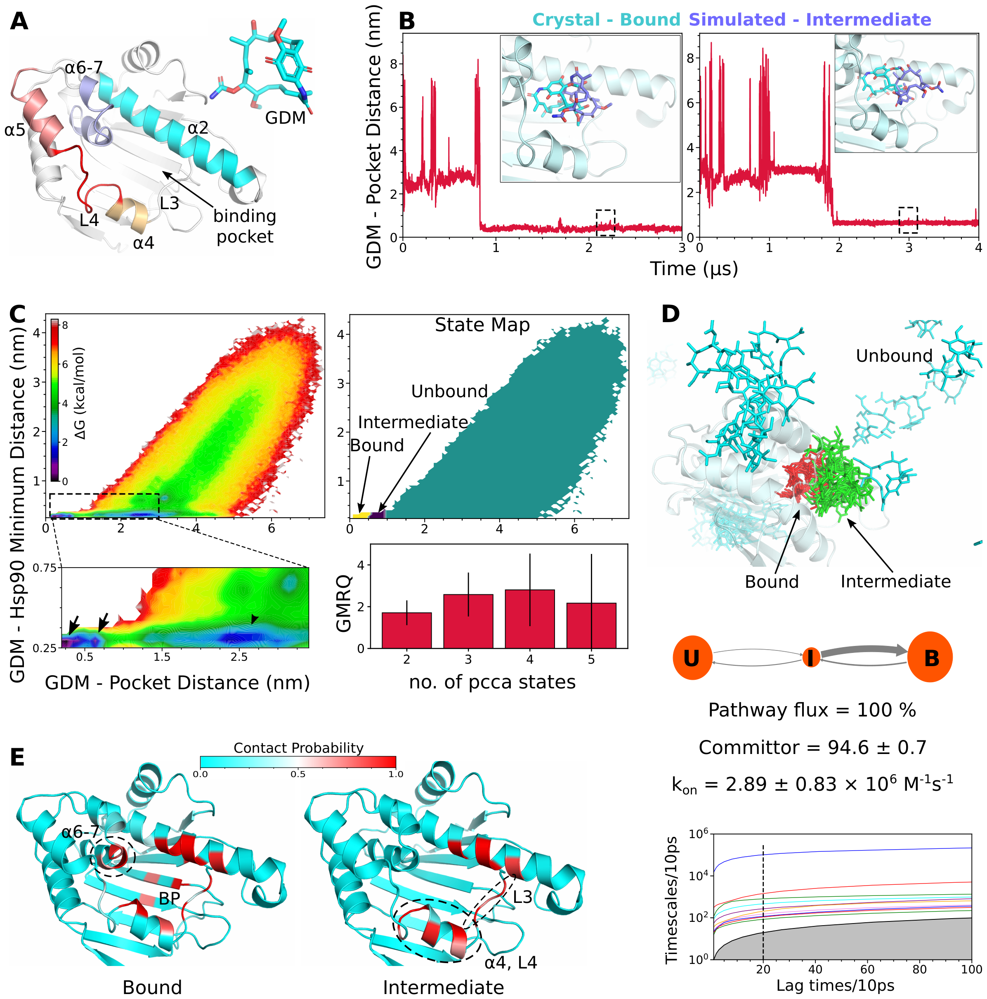

# Dynamic Insights into Hsp90 Inhibitor Binding: Uncovering Intermediate States and Conformational Plasticity

Heat shock protein 90 (Hsp90) is a vital molecular chaperone involved in protein folding, stabilization, and activation, making it a key target in cancer therapy. Targeting the N-terminal domain of Hsp90 (N-Hsp90) has emerged as a potential strategy for developing anticancer therapies due to its involvement in the folding and function of oncoproteins. However, the precise molecular details of how inhibitors bind to N-Hsp90 remain elusive due to inherent conformational plasticity involving \textit{loop-in} and \textit{loop-out} states of loop-4 (L4) . In this work, we utilized unbiased molecular dynamics (MD) simulations coupled with Markov state modeling (MSM) and machine learning techniques to investigate the binding dynamics of the inhibitor Geldanamycin (GDM). Our findings reveal a complex two-stage binding mechanism involving the formation of a non-native intermediate state prior to the final bound state.  We demonstrate that GDM binding predominantly stabilizes the \textit{loop-out} conformation of N-Hsp90, challenging prior beliefs and suggesting that \textit{both} conformational selection and induced fit mechanisms are involved.  Through a detailed residue-level analysis using Random Forest based ML classifiers, we quantify the relative contributions of these mechanisms, highlighting the dynamic interplay between Hsp90's conformational states during inhibitor binding. These findings enhance our understanding of Hsp90's conformational plasticity and could inform the design of more effective Hsp90 inhibitors.

Manuscript: 

